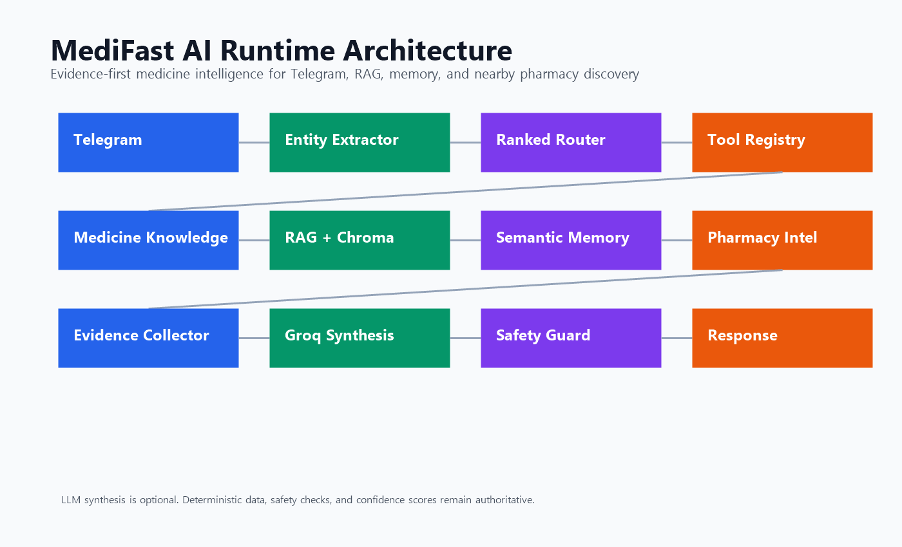
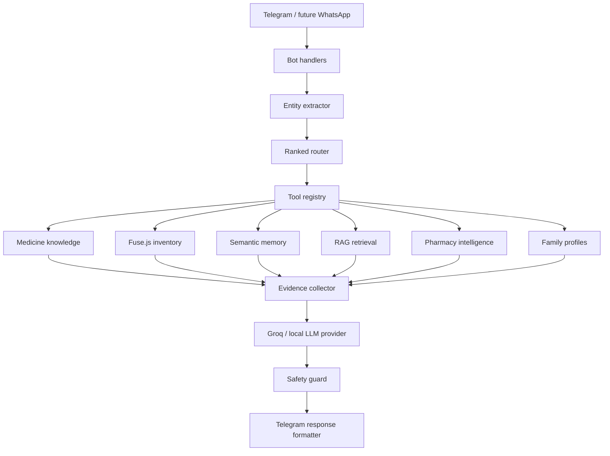
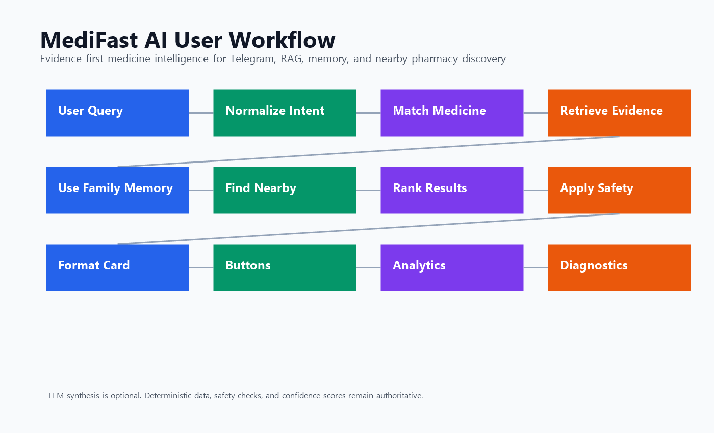

# MediFast AI

**India-first AI medicine assistant for intelligent medicine understanding, contextual healthcare assistance, and nearby pharmacy discovery.**


MediFast AI turns a Telegram medicine bot into a product-grade healthcare assistant for India. It understands medicine brands, generics, salts, Hinglish symptom queries, family context, side effects, and nearby pharmacies while keeping deterministic systems as the source of truth.

Medical safety note: MediFast helps users discover medicine information and nearby pharmacy options. It is not a replacement for a doctor.

## Overview

MediFast AI is built for fast, local, family-friendly medicine discovery:

- Search Indian medicines by brand, generic, salt, alias, typo, or no-space names.
- Understand Hinglish and Hindi-style queries like `bukhar ki tablet`, `sar dard`, and `gas acidity`.
- Find nearby pharmacies using Telegram shared location and MongoDB geospatial search.
- Preserve family context such as father has BP or mother has acidity.
- Retrieve trusted medicine knowledge with RAG.
- Use Groq/Llama only for evidence-based response synthesis, not as a medical source of truth.
- Provide diagnostics, runtime tracing, analytics, and production health checks.

## Features

- **Medicine intelligence:** brand to generic matching, salt matching, fuzzy matching, aliases, common spellings, and semantic fallback.
- **Large catalog support:** import and normalize large Indian medicine datasets into `MedicineKnowledge`.
- **Knowledge graph:** relationships for brand, generic, symptom, side effect, category, manufacturer, alternative, and refill behavior.
- **Side-effect enrichment:** merge trusted side-effect CSV data into the medicine catalog.
- **Hinglish smart search:** maps phrases like `bukhar`, `khansi`, `pet dard`, `gas`, and `ulti` to useful search intents.
- **Family profiles:** store family members, conditions, medicines, and reorder patterns.
- **Semantic memory:** retrieve useful past family facts during future conversations.
- **Nearby pharmacy discovery:** uses Telegram location, MongoDB `2dsphere` queries, ranking, OSM import, and live fallback-ready services.
- **Evidence-based orchestration:** router, tool registry, evidence collector, Groq provider, safety guard, and Telegram formatter.
- **RAG:** Chroma or local vector mode over trusted knowledge files and activated medicine knowledge.
- **Admin readiness:** `/health`, `/analytics`, `/status`, `/runtime`, `/trace`, `/nearby-debug`, and `/admindebug`.
- **Production diagnostics:** medicine, catalog, RAG, LLM, memory, pharmacy, and full health checks.

## Architecture Diagram





## How It Works



1. User sends a Telegram message.
2. Entity extractor identifies medicine, symptom, person, location intent, side-effect intent, and reorder intent.
3. Router returns ranked tool decisions.
4. Tool executor calls deterministic systems such as MedicineKnowledge, Fuse.js search, RAG, memory, family, and pharmacy services.
5. Evidence collector builds a structured evidence packet.
6. Groq can synthesize a clean answer when enabled.
7. Safety guard checks confidence and medical risk.
8. Formatter sends a compact Telegram response with action buttons.

## Medicine Intelligence

MediFast keeps inventory and knowledge separate:

- `Inventory`: stock, price, pharmacy, and availability.
- `MedicineKnowledge`: name, generic, salts, brands, aliases, category, symptoms, side effects, precautions, and relationships.

Matching order:

```text
exact match
  -> alias match
  -> brand match
  -> salt match
  -> fuzzy match
  -> semantic match
  -> clarification
```

Examples supported:

```text
Dolo 650
Pregabalin
Alprax
Pantocid
Telma AM
MontekLC
headache tablet
bukhar ki tablet
sugar medicine
```

## Nearby Pharmacy Intelligence

Nearby search uses real user coordinates from Telegram.

Flow:

```text
Telegram location
  -> Mongo geo query
  -> 5 km search
  -> 10 km expansion if needed
  -> OSM fallback-ready source layer
  -> pharmacy enrichment
  -> ranking
  -> response card
```

Ranking considers:

- distance
- inventory confidence
- pharmacy confidence
- popularity score
- source quality

Returned result fields can include pharmacy name, phone, address, distance, open status, popularity score, inventory confidence, and source.

## Semantic Memory

MediFast stores structured facts instead of plain chat logs:

```json
{
  "type": "condition",
  "entity": "father",
  "value": "BP",
  "confidence": 0.9,
  "source": "message"
}
```

This allows flows like:

```text
User: Papa has BP and diabetes
Later: medicine for papa
Bot: uses family and memory context before responding
```

## RAG

Knowledge files live in:

```text
knowledge-base/
  medicines/
  side_effects/
  symptoms/
  drug_interactions/
  guidelines/
  faq/
```

The RAG pipeline loads Markdown, PDF, and CSV files, chunks them, embeds them, stores vectors, retrieves context, reranks results, and passes evidence into the orchestrator.

Vector modes:

- Remote Chroma: set `CHROMA_URL=http://localhost:8000`
- Local persistent mode: set `VECTOR_MODE=local` and use `data/chroma`

## Knowledge Graph

MediFast expands medicine relationships:

```text
brand <-> generic
medicine <-> symptom
medicine <-> disease
medicine <-> side effect
medicine <-> category
medicine <-> alternative
medicine <-> refill pattern
medicine <-> pharmacy demand
```

The graph improves normalizer confidence, nearby medicine confidence, and RAG retrieval.

## Groq Orchestration

Groq is optional and evidence-based.

It can summarize and combine:

- medicine context
- relationship graph context
- semantic memory
- RAG context
- nearby pharmacy context
- confidence scores

It must not invent medicines, dosage, stock, or pharmacy availability.

## Screenshots

Screenshots can be added after Telegram testing:

```text
assets/readme/screenshots/
  welcome.png
  medicine-search.png
  nearby-pharmacy.png
  side-effects.png
  runtime-trace.png
```

## Example Telegram Conversations

```text
User: Dolo 650
Bot: Found Dolo 650. Generic: Paracetamol. Category: Pain/Fever. Confidence: high.
     Actions: Nearby | Side Effects | Alternatives | Save
```

```text
User: bukhar ki tablet
Bot: I understood this as fever medicine search. I can show common fever-related options, but please consult a doctor for diagnosis or dosage.
     Actions: Search Medicines | Nearby | Family
```

```text
User: Dolo near me
Bot: Share your location to find nearby pharmacies.
     Button: Share Location
```

```text
User: side effects of Pregabalin
Bot: Retrieved Pregabalin knowledge and side-effect context from the catalog/RAG. Please review with a doctor, especially for prescription medicines.
```

```text
User: Papa has BP and diabetes
Bot: Saved this as family context. I will use it for safer future medicine discovery.
```

## Installation

```bash
git clone https://github.com/Ruchin-Audichya/medifast-bot.git
cd medifast-bot
npm install
```

Use Node.js 18 or newer.

## Setup

Create `.env` from `.env.example`:

```bash
cp .env.example .env
```

For Windows PowerShell:

```powershell
Copy-Item .env.example .env
```

Start MongoDB locally or provide a hosted MongoDB URI.

## Environment Variables

Key groups:

```env
# Telegram
TELEGRAM_BOT_TOKEN=

# MongoDB
MONGODB_URI=mongodb://localhost:27017/medifast

# Groq / LLM
LLM_PROVIDER=groq
ENABLE_LLM_SYNTHESIS=false
GROQ_API_KEY=
GROQ_MODEL=meta-llama/llama-4-scout-17b-16e-instruct

# RAG
VECTOR_MODE=local
CHROMA_URL=
VECTOR_STORE_PATH=./data/chroma

# Debug
AI_DEBUG=false
```

Full documentation is in `.env.example`.

## Running Locally

```bash
npm start
```

Development mode:

```bash
npm run dev
```

Run a runtime trace:

```bash
npm run runtime -- "Dolo near me"
```

## Commands

User-facing Telegram commands include:

```text
/start
/search
/nearby
/family
/addmember
/members
/removeMember
/health
/analytics
/status
/runtime
/trace
/nearby-debug
/admindebug
```

Data and diagnostics scripts:

```bash
npm run ingest
npm run import-medicines
npm run import-pharmacies
npm run activate-data
npm run catalog-status
npm run cleanup-duplicates
npm run diagnose-medicines
npm run diagnose-catalog
npm run diagnose-pharmacies
npm run diagnose-rag
npm run diagnose-llm
npm run diagnose-memory
npm run production-health
```

## Project Structure

```text
src/
  ai/                 deterministic entity extraction, routing, safety
  bot/                Telegram handlers and commands
  cache/              medicine cache
  diagnostics/        production health and runtime trace helpers
  events/             event bus and analytics listeners
  medicine/           catalog, importer, normalizer, graph, enrichment
  memory/             summarization and semantic memory
  models/             MongoDB schemas
  orchestrator/       planning, tool execution, evidence collection
  pharmacy/           nearby search, ranking, OSM source pipeline
  providers/          Groq/local/deterministic provider abstractions
  rag/                loaders, chunking, embeddings, retrieval, diagnostics
  services/           reusable app services
  utils/              formatters and helpers

knowledge-base/       trusted RAG documents
data/medicine-sources medicine CSV/JSON drops
scripts/              imports, diagnostics, health, runtime tracing
tests/                Node test suite
docs/                 architecture and testing documentation
assets/readme/        GitHub diagrams
```

## Testing

Run all tests:

```bash
npm test
```

Run formatting check:

```bash
git diff --check
```

Pre-demo health:

```bash
npm run production-health
```

## Roadmap

- Complete full catalog vector activation beyond the current partial coverage.
- Add more verified India-specific medicine data sources.
- Add WhatsApp adapter.
- Add pharmacy live stock integrations.
- Add guardian notification flows with explicit user consent.
- Add voice-note understanding.
- Add dashboard for top medicines, symptoms, locations, and failed lookups.
- Add open-source LLM deployment path for cheaper private inference.

## Future Improvements

- Better medicine disambiguation for same-brand combinations.
- Stronger prescription-risk classifier.
- More robust open/closed pharmacy hours from OSM tags.
- City-wise pharmacy import jobs for all major Indian cities.
- Chroma deployment profile for production.
- Admin web dashboard.
- Continuous catalog quality scoring.

## Contributors

Built by Ruchin Audichya as an India-first healthcare assistant MVP.

## License

Add a license before public production use if this repository is intended for open-source distribution.
