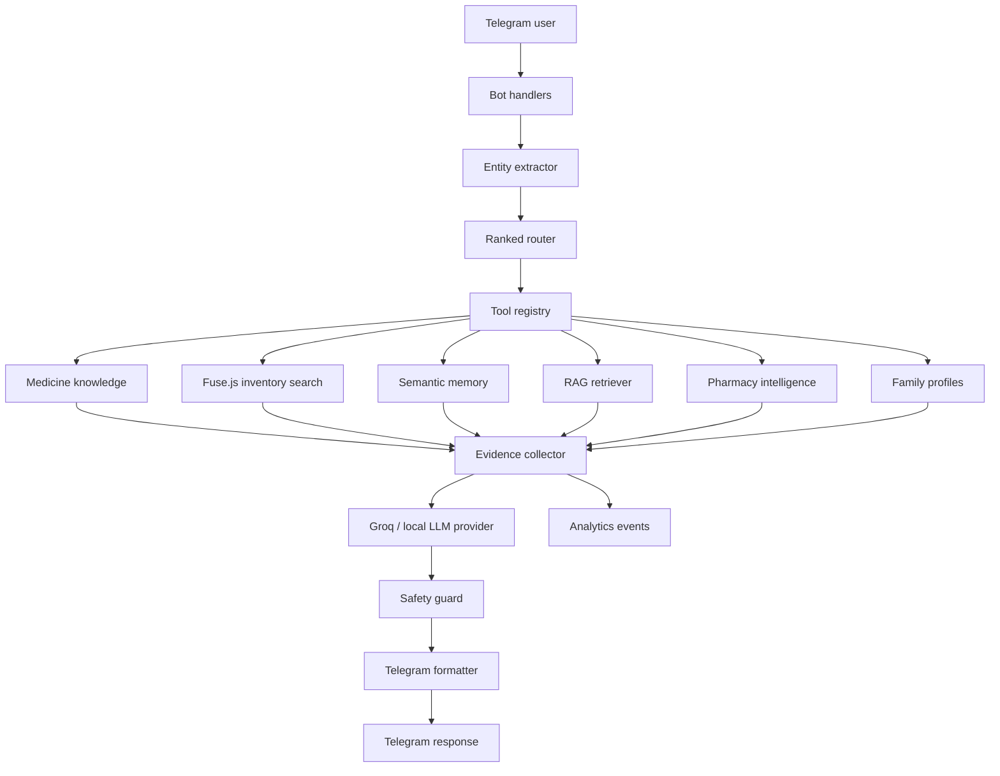

# MediFast AI Architecture

MediFast AI is a Telegram-first medicine assistant built around deterministic medicine search, MongoDB data, retrieval-augmented knowledge, semantic memory, and evidence-based LLM synthesis.

The important design rule is simple: the LLM can explain and combine evidence, but it is not the source of truth. Medicine records, pharmacy records, family profiles, search history, RAG retrieval, and safety checks stay in normal services that can be tested and debugged.

## Runtime Architecture

## Core Principles

- Keep Fuse.js and MongoDB as the fast deterministic search layer.
- Keep MedicineKnowledge separate from pharmacy inventory.
- Use Chroma for retrieval over knowledge documents and activated medicine knowledge.
- Use semantic memory for user and family context, not as a replacement for profiles.
- Use Groq only for response synthesis when `ENABLE_LLM_SYNTHESIS=true`.
- Never invent medicines, stock, dosage, pharmacy availability, or medical facts.
- Always pass final output through the safety guard.

## Main Modules

### Bot Layer

The Telegram entry point lives in `src/bot/index.js`. Commands are split under `src/bot/commands/`, including search, nearby, admin, health, runtime tracing, and onboarding-related flows.

### AI Layer

`src/ai/` contains the deterministic intelligence entry points:

- `entityExtractor.js` extracts people, medicines, symptoms, duration, nearby intent, side-effect intent, and reorder signals.
- `router.js` returns ranked tool decisions instead of one hard route.
- `toolRegistry.js` defines tool contracts for deterministic services.
- `safetyGuard.js` appends warnings, handles low confidence, and prevents unsafe responses.

### Orchestrator

`src/orchestrator/` connects router output to actual tool execution:

- `workflowPlanner.js` turns ranked routes into an execution plan.
- `toolExecutor.js` executes tools through the registry.
- `evidenceCollector.js` builds the evidence packet.
- `responseMerger.js` produces deterministic fallbacks and LLM-ready context.
- `orchestrator.js` coordinates the full request.

### Medicine Intelligence

`src/medicine/` owns the medicine catalog:

- `medicineKnowledgeService.js` searches MedicineKnowledge records.
- `medicineNormalizer.js` handles brand, salt, alias, typo, and no-space queries.
- `medicineRelationshipService.js` builds relationships such as brand to generic, medicine to side effect, and medicine to symptom.
- `medicineImporter.js` imports CSV/JSON datasets.
- `matching/` improves exact, alias, fuzzy, and semantic matching.
- `enrichment/` merges side-effect datasets safely.
- `diagnostics/` reports catalog quality and activation status.

Inventory is still separate from knowledge. Inventory answers availability and stock. MedicineKnowledge answers meaning, category, salt, aliases, side effects, and relationships.

### RAG

`src/rag/` supports knowledge retrieval:

- `documentLoader.js` loads Markdown, PDF, and CSV files.
- `chunker.js` creates retrieval-friendly chunks.
- `embeddingProvider.js` selects local or future providers.
- `retriever.js` queries Chroma-compatible vector storage.
- `hybridRetriever.js` combines vector and keyword retrieval.
- `reranker.js` reranks results using confidence, category, and keyword overlap.
- `medicineKnowledgeIngestion.js` converts MedicineKnowledge records into RAG documents.
- `ragDiagnostics.js` reports vector count, mode, collection status, and retrieval quality.

The vector layer supports remote Chroma via `CHROMA_URL` and local persistent mode via `VECTOR_MODE=local`.

### Memory

`src/memory/` and `src/services/memoryService.js` store structured facts such as:

- father has BP
- mother has acidity
- user searched Dolo 650
- family member uses a recurring medicine

Memory compression prevents unlimited message growth while preserving useful facts.

### Pharmacy Intelligence

`src/pharmacy/` owns nearby discovery:

- `pharmacyLocationService.js` handles user coordinates.
- `pharmacySearchService.js` runs Mongo geospatial search.
- `pharmacyRankingService.js` ranks by distance, confidence, popularity, and inventory estimate.
- `pharmacyAvailabilityService.js` estimates medicine confidence using aliases, categories, and relationships.
- `sources/osmPharmacySource.js` imports OpenStreetMap pharmacy data.

MongoDB uses a `2dsphere` index on `Pharmacy.location`.

### Providers

`src/providers/` abstracts response generation:

- `baseLLMProvider.js`
- `groqProvider.js`
- `localLlamaProvider.js`
- deterministic fallback providers

This keeps provider-specific code out of bot handlers.

## Data Stores

- MongoDB: medicine knowledge, pharmacies, users, search history, SOS requests, conversation memory, analytics.
- Chroma or local vector store: RAG knowledge and semantic memory vectors.
- Filesystem: knowledge-base documents, medicine source datasets, local vector persistence, diagnostics output.

## Safety Model

MediFast is an assistant for discovery, not diagnosis. The safety guard:

- asks clarification on low confidence
- warns for child/senior contexts
- warns around prescription-sensitive medicines
- prevents hallucinated medicine and pharmacy claims
- appends a small medical disclaimer

